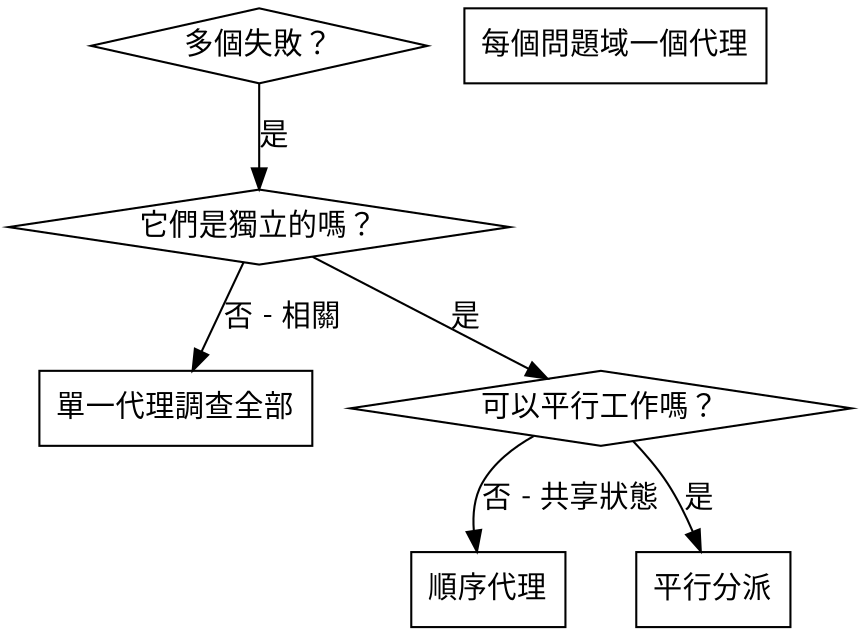

# 分派平行代理

## 概述

當你有多個不相關的失敗（不同的測試檔案、不同的子系統、不同的錯誤）時，按順序調查會浪費時間。每個調查都是獨立的，可以平行進行。

**核心原則：** 每個獨立的問題域分派一個代理。讓它們同時工作。

## 何時使用



**使用時機：**
- 3 個以上測試檔案因不同根本原因失敗
- 多個子系統獨立損壞
- 每個問題可以在不需要其他問題上下文的情況下理解
- 調查之間沒有共享狀態

**不要使用時機：**
- 失敗是相關的（修復一個可能會修復其他）
- 需要理解完整的系統狀態
- 代理會互相干擾

## 模式

### 1. 識別獨立域

按損壞的內容分組失敗：
- 檔案 A 測試：工具審批流程
- 檔案 B 測試：批次完成行為
- 檔案 C 測試：中止功能

每個域都是獨立的 - 修復工具審批不會影響中止測試。

### 2. 建立聚焦的代理任務

每個代理獲得：
- **特定範圍：** 一個測試檔案或子系統
- **明確目標：** 讓這些測試通過
- **約束：** 不要更改其他程式碼
- **預期輸出：** 你發現和修復內容的摘要

### 3. 平行分派

```typescript
// 在 Claude Code / AI 環境中
Task("修復 agent-tool-abort.test.ts 失敗")
Task("修復 batch-completion-behavior.test.ts 失敗")
Task("修復 tool-approval-race-conditions.test.ts 失敗")
// 三個同時運行
```

### 4. 審查和整合

當代理返回時：
- 閱讀每個摘要
- 驗證修復不衝突
- 執行完整測試套件
- 整合所有變更

## 代理提示結構

好的代理提示應該是：
1. **聚焦** - 一個明確的問題域
2. **自包含** - 理解問題所需的所有上下文
3. **具體說明輸出** - 代理應該返回什麼？

```markdown
修復 src/agents/agent-tool-abort.test.ts 中的 3 個失敗測試：

1. "should abort tool with partial output capture" - 預期訊息中有 'interrupted at'
2. "should handle mixed completed and aborted tools" - 快速工具被中止而不是完成
3. "should properly track pendingToolCount" - 預期 3 個結果但得到 0

這些是時序/競爭條件問題。你的任務：

1. 閱讀測試檔案並理解每個測試驗證什麼
2. 識別根本原因 - 時序問題還是實際錯誤？
3. 修復方法：
   - 用基於事件的等待替換任意超時
   - 如果發現，修復中止實作中的錯誤
   - 如果測試的是已更改的行為，調整測試預期

不要只是增加超時 - 找到真正的問題。

返回：你發現什麼以及修復了什麼的摘要。
```

## 常見錯誤

**❌ 太廣泛：** "修復所有測試" - 代理會迷失
**✅ 具體：** "修復 agent-tool-abort.test.ts" - 聚焦範圍

**❌ 沒有上下文：** "修復競爭條件" - 代理不知道在哪裡
**✅ 上下文：** 貼上錯誤訊息和測試名稱

**❌ 沒有約束：** 代理可能會重構所有東西
**✅ 約束：** "不要更改生產程式碼" 或 "只修復測試"

**❌ 模糊輸出：** "修復它" - 你不知道改變了什麼
**✅ 具體：** "返回根本原因和變更的摘要"

## 何時不使用

**相關失敗：** 修復一個可能會修復其他 - 先一起調查
**需要完整上下文：** 理解需要看到整個系統
**探索性除錯：** 你還不知道什麼壞了
**共享狀態：** 代理會互相干擾（編輯相同檔案、使用相同資源）

## 會話中的真實範例

**場景：** 重大重構後 3 個檔案中有 6 個測試失敗

**失敗：**
- agent-tool-abort.test.ts：3 個失敗（時序問題）
- batch-completion-behavior.test.ts：2 個失敗（工具未執行）
- tool-approval-race-conditions.test.ts：1 個失敗（執行計數 = 0）

**決定：** 獨立域 - 中止邏輯與批次完成與競爭條件分開

**分派：**
```
代理 1 → 修復 agent-tool-abort.test.ts
代理 2 → 修復 batch-completion-behavior.test.ts
代理 3 → 修復 tool-approval-race-conditions.test.ts
```

**結果：**
- 代理 1：用基於事件的等待替換超時
- 代理 2：修復事件結構錯誤（threadId 在錯誤的位置）
- 代理 3：新增等待非同步工具執行完成

**整合：** 所有修復獨立，無衝突，完整套件通過

**節省時間：** 3 個問題平行解決 vs 順序解決

## 主要優點

1. **平行化** - 多個調查同時進行
2. **聚焦** - 每個代理範圍窄，追蹤的上下文少
3. **獨立性** - 代理不會互相干擾
4. **速度** - 3 個問題在 1 個的時間內解決

## 驗證

代理返回後：
1. **審查每個摘要** - 理解改變了什麼
2. **檢查衝突** - 代理是否編輯了相同的程式碼？
3. **執行完整套件** - 驗證所有修復一起工作
4. **抽查** - 代理可能會犯系統性錯誤

## 真實世界影響

來自除錯會話（2025-10-03）：
- 3 個檔案中 6 個失敗
- 平行分派 3 個代理
- 所有調查同時完成
- 所有修復成功整合
- 代理變更之間零衝突
