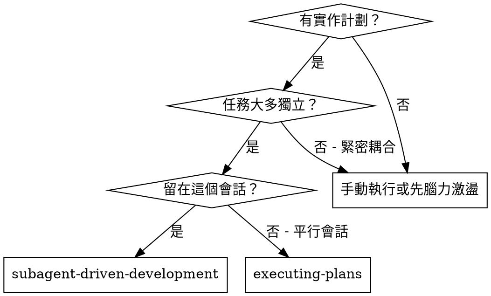
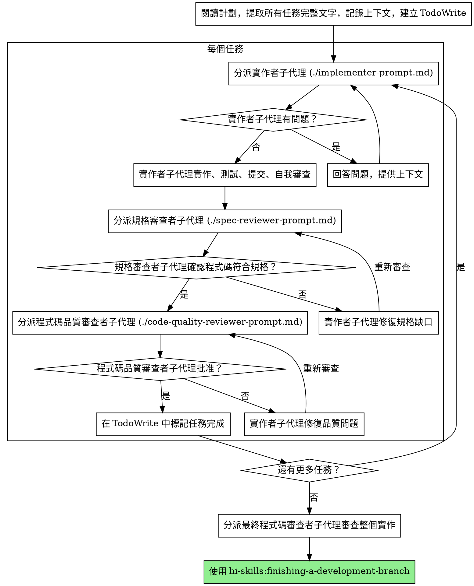

# 子代理驅動開發

透過為每個任務分派新的子代理來執行計劃，每個任務後進行兩階段審查：首先是規格符合性審查，然後是程式碼品質審查。

**核心原則：** 每個任務一個新子代理 + 兩階段審查（規格然後品質）= 高品質，快速迭代

## 何時使用



**與執行計劃（平行會話）比較：**
- 同一會話（無上下文切換）
- 每個任務一個新子代理（無上下文污染）
- 每個任務後兩階段審查：首先是規格符合性，然後是程式碼品質
- 更快的迭代（任務之間無人工介入）

## 流程



## 提示模板

- `./implementer-prompt.md` - 分派實作者子代理
- `./spec-reviewer-prompt.md` - 分派規格符合性審查者子代理
- `./code-quality-reviewer-prompt.md` - 分派程式碼品質審查者子代理

## 範例工作流程

```
你：我正在使用子代理驅動開發來執行這個計劃。

[讀取計劃檔案一次：docs/plans/feature-plan.md]
[提取所有 5 個任務的完整文字和上下文]
[建立包含所有任務的 TodoWrite]

任務 1：Hook 安裝腳本

[獲取任務 1 文字和上下文（已提取）]
[分派實作子代理，附完整任務文字 + 上下文]

實作者："在我開始之前 - hook 應該安裝在用戶級別還是系統級別？"

你："用戶級別 (~/.config/hi-skills/hooks/)"

實作者："明白了。現在實作中..."
[稍後] 實作者：
  - 實作了 install-hook 命令
  - 新增測試，5/5 通過
  - 自我審查：發現我漏掉了 --force 標誌，已新增
  - 已提交

[分派規格符合性審查者]
規格審查者：✅ 符合規格 - 所有需求已滿足，沒有多餘的

[獲取 git SHA，分派程式碼品質審查者]
程式碼審查者：優點：良好的測試覆蓋率，乾淨。問題：無。已批准。

[標記任務 1 完成]

任務 2：恢復模式

[獲取任務 2 文字和上下文（已提取）]
[分派實作子代理，附完整任務文字 + 上下文]

實作者：[沒有問題，繼續]
實作者：
  - 新增 verify/repair 模式
  - 8/8 測試通過
  - 自我審查：一切正常
  - 已提交

[分派規格符合性審查者]
規格審查者：❌ 問題：
  - 缺少：進度報告（規格說"每 100 項報告"）
  - 多餘：新增了 --json 標誌（未請求）

[實作者修復問題]
實作者：移除 --json 標誌，新增進度報告

[規格審查者再次審查]
規格審查者：✅ 現在符合規格

[分派程式碼品質審查者]
程式碼審查者：優點：穩固。問題（重要）：魔術數字 (100)

[實作者修復]
實作者：提取 PROGRESS_INTERVAL 常數

[程式碼審查者再次審查]
程式碼審查者：✅ 已批准

[標記任務 2 完成]

...

[所有任務後]
[分派最終程式碼審查者]
最終審查者：所有需求已滿足，準備合併

完成！
```

## 優勢

**與手動執行比較：**
- 子代理自然遵循 TDD
- 每個任務新上下文（無混淆）
- 平行安全（子代理不會互相干擾）
- 子代理可以提問（工作前和期間）

**與執行計劃比較：**
- 同一會話（無交接）
- 持續進展（無等待）
- 審查檢查點自動化

**效率提升：**
- 無檔案讀取開銷（控制器提供完整文字）
- 控制器精確策劃需要什麼上下文
- 子代理預先獲得完整資訊
- 問題在工作開始前浮現（而不是之後）

**品質把關：**
- 自我審查在交接前捕獲問題
- 兩階段審查：規格符合性，然後程式碼品質
- 審查迴圈確保修復真正有效
- 規格符合性防止過度/不足建置
- 程式碼品質確保實作良好

**成本：**
- 更多子代理調用（每個任務有實作者 + 2 個審查者）
- 控制器做更多準備工作（預先提取所有任務）
- 審查迴圈增加迭代
- 但早期捕獲問題（比稍後除錯便宜）

## 危險信號

**絕不：**
- 跳過審查（規格符合性或程式碼品質）
- 在未修復問題下繼續
- 平行分派多個實作子代理（衝突）
- 讓子代理讀取計劃檔案（改為提供完整文字）
- 跳過場景設定上下文（子代理需要理解任務的位置）
- 忽略子代理問題（在讓他們繼續之前回答）
- 接受規格符合性上的"差不多"（規格審查者發現問題 = 未完成）
- 跳過審查迴圈（審查者發現問題 = 實作者修復 = 再次審查）
- 讓實作者自我審查取代實際審查（兩者都需要）
- **在規格符合性通過 ✅ 之前開始程式碼品質審查**（順序錯誤）
- 在任一審查有未解決問題時移動到下一個任務

**如果子代理提問：**
- 清楚完整地回答
- 如果需要提供額外上下文
- 不要催促他們進入實作

**如果審查者發現問題：**
- 實作者（同一子代理）修復它們
- 審查者再次審查
- 重複直到批准
- 不要跳過重新審查

**如果子代理任務失敗：**
- 分派修復子代理，附具體指示
- 不要嘗試手動修復（上下文污染）

## 整合

**必要工作流程技能：**
- **hi-skills:writing-plans** - 建立此技能執行的計劃
- **hi-skills:requesting-code-review** - 審查者子代理的程式碼審查模板
- **hi-skills:finishing-a-development-branch** - 所有任務後完成開發

**子代理應該使用：**
- **hi-skills:test-driven-development** - 子代理為每個任務遵循 TDD

**替代工作流程：**
- **hi-skills:executing-plans** - 用於平行會話而不是同一會話執行
