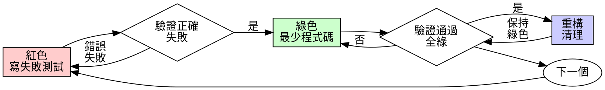

# 測試驅動開發 (TDD)

## 概述

先寫測試。看著它失敗。寫最少的程式碼讓它通過。

**核心原則：** 如果你沒有看著測試失敗，你不知道它是否測試了正確的東西。

**違反規則的字面意思就是違反規則的精神。**

## 何時使用

**始終：**
- 新功能
- 錯誤修復
- 重構
- 行為變更

**例外（詢問你的人類夥伴）：**
- 一次性原型
- 生成的程式碼
- 配置檔案

想著"只這一次跳過 TDD"？停下來。那是合理化。

## 鐵律

```
沒有先失敗的測試就沒有生產程式碼
```

在測試之前寫程式碼？刪除它。重新開始。

**沒有例外：**
- 不要保留它作為"參考"
- 不要在寫測試時"調整"它
- 不要看它
- 刪除意味著刪除

從測試重新實作。句號。

## 紅-綠-重構



### 紅色 - 寫失敗測試

寫一個最小的測試顯示應該發生什麼。

<Good>
```typescript
test('重試失敗操作 3 次', async () => {
  let attempts = 0;
  const operation = () => {
    attempts++;
    if (attempts < 3) throw new Error('fail');
    return 'success';
  };

  const result = await retryOperation(operation);

  expect(result).toBe('success');
  expect(attempts).toBe(3);
});
```
清晰的名稱，測試真實行為，一件事
</Good>

<Bad>
```typescript
test('重試有效', async () => {
  const mock = jest.fn()
    .mockRejectedValueOnce(new Error())
    .mockRejectedValueOnce(new Error())
    .mockResolvedValueOnce('success');
  await retryOperation(mock);
  expect(mock).toHaveBeenCalledTimes(3);
});
```
模糊的名稱，測試 mock 而不是程式碼
</Bad>

**要求：**
- 一個行為
- 清晰的名稱
- 真實程式碼（除非不可避免否則不用 mock）

### 驗證紅色 - 看著它失敗

**強制。絕不跳過。**

```bash
npm test path/to/test.test.ts
```

確認：
- 測試失敗（不是錯誤）
- 失敗訊息是預期的
- 因為功能缺失而失敗（不是拼寫錯誤）

**測試通過了？** 你在測試現有行為。修復測試。

**測試錯誤了？** 修復錯誤，重新執行直到它正確失敗。

### 綠色 - 最少程式碼

寫最簡單的程式碼讓測試通過。

<Good>
```typescript
async function retryOperation<T>(fn: () => Promise<T>): Promise<T> {
  for (let i = 0; i < 3; i++) {
    try {
      return await fn();
    } catch (e) {
      if (i === 2) throw e;
    }
  }
  throw new Error('unreachable');
}
```
剛好足夠通過
</Good>

<Bad>
```typescript
async function retryOperation<T>(
  fn: () => Promise<T>,
  options?: {
    maxRetries?: number;
    backoff?: 'linear' | 'exponential';
    onRetry?: (attempt: number) => void;
  }
): Promise<T> {
  // YAGNI
}
```
過度工程
</Bad>

不要添加功能，重構其他程式碼，或超出測試"改進"。

### 驗證綠色 - 看著它通過

**強制。**

```bash
npm test path/to/test.test.ts
```

確認：
- 測試通過
- 其他測試仍然通過
- 輸出乾淨（沒有錯誤、警告）

**測試失敗？** 修復程式碼，不是測試。

**其他測試失敗？** 現在修復。

### 重構 - 清理

只在綠色之後：
- 移除重複
- 改進名稱
- 提取輔助函數

保持測試綠色。不要添加行為。

### 重複

下一個失敗測試為下一個功能。

## 好測試

| 品質 | 好 | 壞 |
|---------|------|-----|
| **最小** | 一件事。名稱中有 "和"？拆分它。 | `test('驗證電子郵件和網域和空白')` |
| **清晰** | 名稱描述行為 | `test('test1')` |
| **顯示意圖** | 展示期望的 API | 模糊程式碼應該做什麼 |

## 為什麼順序很重要

**"我會在之後寫測試來驗證它有效"**

之後寫的測試立即通過。立即通過什麼都不證明：
- 可能測試錯誤的東西
- 可能測試實作，不是行為
- 可能錯過你忘記的邊緣案例
- 你從未看到它捕獲錯誤

先測試強迫你看到測試失敗，證明它確實測試了什麼。

**"我已經手動測試了所有邊緣案例"**

手動測試是臨時的。你認為你測試了所有東西但：
- 沒有你測試了什麼的記錄
- 程式碼變更時無法重新執行
- 壓力下容易忘記案例
- "我試的時候有效" ≠ 全面

自動化測試是系統的。它們每次都以相同方式執行。

**"刪除 X 小時的工作是浪費"**

沉沒成本謬誤。時間已經過去了。你現在的選擇：
- 刪除並用 TDD 重寫（X 更多小時，高信心）
- 保留它並在之後添加測試（30 分鐘，低信心，可能有錯誤）

"浪費"是保留你無法信任的程式碼。沒有真正測試的工作程式碼是技術債務。

**"TDD 是教條式的，務實意味著適應"**

TDD 就是務實的：
- 在提交前發現錯誤（比之後除錯更快）
- 防止迴歸（測試立即捕獲破壞）
- 記錄行為（測試顯示如何使用程式碼）
- 啟用重構（自由變更，測試捕獲破壞）

"務實"的捷徑 = 在生產中除錯 = 更慢。

**"之後的測試達到相同目標 - 是精神不是儀式"**

不是。之後的測試回答"這做了什麼？"先測試回答"這應該做什麼？"

之後的測試被你的實作偏見。你測試你建置的東西，不是需要什麼。你驗證記住的邊緣案例，不是發現的。

先測試強制在實作前發現邊緣案例。之後測試驗證你記住了所有東西（你沒有）。

30 分鐘的之後測試 ≠ TDD。你得到覆蓋率，失去測試有效的證明。

## 常見合理化

| 藉口 | 現實 |
|--------|---------|
| "太簡單不需要測試" | 簡單程式碼會壞。測試需要 30 秒。 |
| "我會在之後測試" | 立即通過的測試什麼都不證明。 |
| "之後的測試達到相同目標" | 之後的測試 = "這做了什麼？" 先測試 = "這應該做什麼？" |
| "已經手動測試了" | 臨時 ≠ 系統。沒有記錄，無法重新執行。 |
| "刪除 X 小時是浪費" | 沉沒成本謬誤。保留未驗證的程式碼是技術債務。 |
| "保留作為參考，先寫測試" | 你會調整它。那是之後測試。刪除意味著刪除。 |
| "需要先探索" | 可以。丟棄探索，從 TDD 開始。 |
| "測試難 = 設計不清楚" | 聽測試。難測試 = 難使用。 |
| "TDD 會讓我變慢" | TDD 比除錯快。務實 = 先測試。 |
| "手動測試更快" | 手動不證明邊緣案例。你會在每次變更時重新測試。 |
| "現有程式碼沒有測試" | 你在改進它。為現有程式碼添加測試。 |

## 危險信號 - 停止並重新開始

- 測試之前的程式碼
- 實作後的測試
- 測試立即通過
- 無法解釋為什麼測試失敗
- 測試"稍後"添加
- 合理化"只這一次"
- "我已經手動測試了"
- "之後的測試達到相同目的"
- "關於精神不是儀式"
- "保留作為參考"或"調整現有程式碼"
- "已經花了 X 小時，刪除是浪費"
- "TDD 是教條式的，我是務實的"
- "這不同因為..."

**所有這些意味著：刪除程式碼。用 TDD 重新開始。**

## 範例：錯誤修復

**錯誤：** 空電子郵件被接受

**紅色**
```typescript
test('拒絕空電子郵件', async () => {
  const result = await submitForm({ email: '' });
  expect(result.error).toBe('Email required');
});
```

**驗證紅色**
```bash
$ npm test
FAIL: expected 'Email required', got undefined
```

**綠色**
```typescript
function submitForm(data: FormData) {
  if (!data.email?.trim()) {
    return { error: 'Email required' };
  }
  // ...
}
```

**驗證綠色**
```bash
$ npm test
PASS
```

**重構**
如果需要為多個欄位提取驗證。

## 驗證清單

在標記工作完成之前：

- [ ] 每個新函數/方法都有測試
- [ ] 在實作前看著每個測試失敗
- [ ] 每個測試因預期原因失敗（功能缺失，不是拼寫錯誤）
- [ ] 為每個測試寫了最少程式碼讓它通過
- [ ] 所有測試通過
- [ ] 輸出乾淨（沒有錯誤、警告）
- [ ] 測試使用真實程式碼（mock 只在不可避免時）
- [ ] 邊緣案例和錯誤被覆蓋

不能勾選所有框？你跳過了 TDD。重新開始。

## 卡住時

| 問題 | 解決方案 |
|---------|----------|
| 不知道如何測試 | 寫期望的 API。先寫斷言。詢問你的人類夥伴。 |
| 測試太複雜 | 設計太複雜。簡化介面。 |
| 必須 mock 所有東西 | 程式碼耦合太緊。使用依賴注入。 |
| 測試設定巨大 | 提取輔助函數。仍然複雜？簡化設計。 |

## 除錯整合

發現錯誤？寫失敗測試重現它。遵循 TDD 循環。測試證明修復並防止迴歸。

絕不在沒有測試的情況下修復錯誤。

## 測試反模式

當添加 mock 或測試工具時，閱讀 @testing-anti-patterns.md 以避免常見陷阱：
- 測試 mock 行為而不是真實行為
- 向生產類添加僅測試方法
- 不理解依賴就 mock

## 最終規則

```
生產程式碼 → 測試存在且先失敗
否則 → 不是 TDD
```

沒有你的人類夥伴許可沒有例外。
